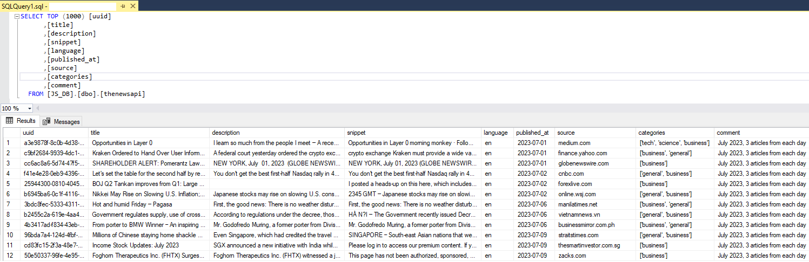

# TheNewsAPI to SQL-database
Scheduled script to get text data from news articles through API and insert the data into an SQL-table.

TheNewsAPI is an API which let's you get news articles published historically. It let's you filter on news catogories, dates, sources etc. Article data consists partly of text data in form of titles, snippets etc. This can be used for text analysis purposes, for example sentiment classification to see if recent news is more or less optimistic than last years, given that the thenewsapi data sources is representative of what you want to draw conclusions from.

thenewsapi_to_SQL_DB.py is a Pyhton script which should be scheduled to run once every day since the free API is limited in how much data you can get each day. It gets the article data from the days before the earliest date of what has already been fetched, and inserts it into a local SQL-server database.

This is how the SQL-table is structured, including example data from the API:

